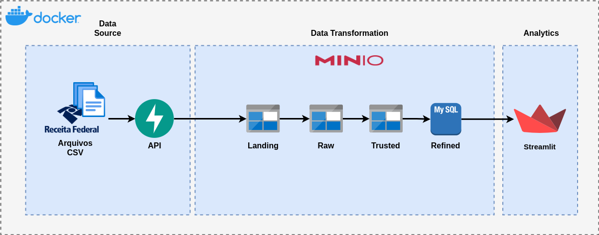

# Data Engineering Project

**Data Engineering Project** é um desafio proposto pela ROIT e tem como o objetivo a implementação do pipeline de dados que consome informações da receita federal sobre empresas e estabelecimentos e tem como o objetivo disponibilizar para os usuários um dash para a visualização de suas principais informações.

<!-- TABLE OF CONTENTS -->
## Table of Contents

* [Architecture diagram](#architecture-diagram)

<!-- ARCHITECTURE DIAGRAM -->
## Architecture diagram

